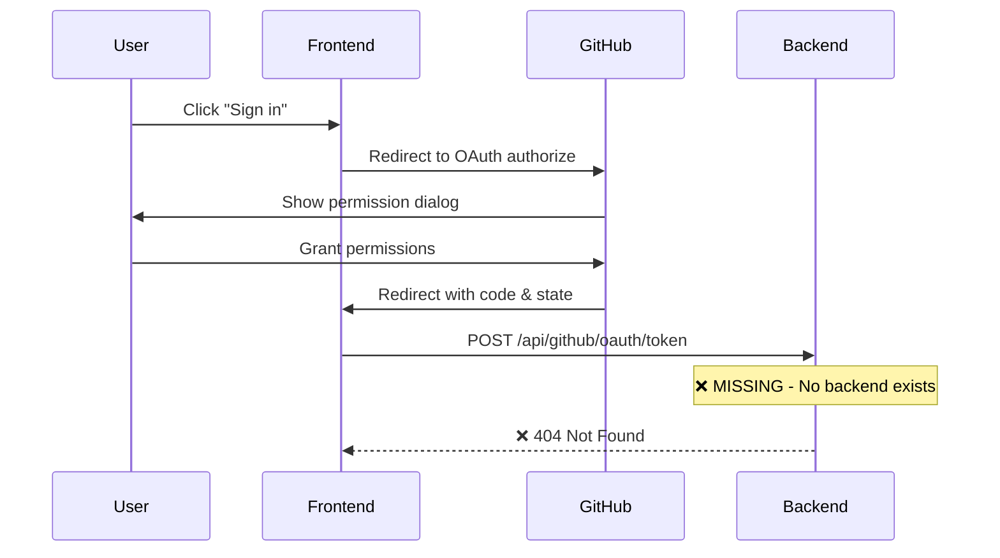

# DevLog-001: GitHub OAuth Authentication Implementation

**Date**: Sun Aug 31 02:35:00 PDT 2025
**Author**: Wentao & Claude
**Status**: ✅ COMPLETED

## Issue Summary

The GitHub OAuth authentication flow is not working on localhost. Users can click "Sign in with GitHub" but the callback fails to complete the authentication process.

## Root Cause Analysis

### 1. **Missing Environment Configuration** ✅ RESOLVED
- **Problem**: No `.env` file with `VITE_GITHUB_CLIENT_ID`
- **Solution**: Created `.env` file with GitHub OAuth app client ID
- **Status**: ✅ Fixed - Client ID now configured: `Ov23liBKTcWHW6CJ9D4m`

### 2. **GitHub OAuth App Setup** ✅ RESOLVED  
- **Problem**: No GitHub OAuth app registered
- **Solution**: Created OAuth app "one-click-paper-page-dev"
  - Homepage URL: `http://localhost:5173/`
  - Callback URL: `http://localhost:5173/auth/callback`
- **Status**: ✅ Fixed

### 3. **Missing Backend API for Token Exchange** ✅ RESOLVED
- **Problem**: Frontend calls `/api/github/oauth/token` but no backend exists
- **Root Cause**: OAuth security requires server-side token exchange
- **Solution**: Implemented FastAPI backend with OAuth endpoints
- **Status**: ✅ Fixed - Backend running on `http://localhost:8001`

## Technical Details

### Current Authentication Flow


### OAuth Security Requirements
- **Authorization Code**: GitHub returns a temporary code to the callback URL
- **Token Exchange**: Code must be exchanged for access token server-side
- **Client Secret**: Required for token exchange, must be kept secret (server-side only)
- **CORS**: GitHub's token endpoint doesn't allow browser requests

## Current Status

### ✅ Working Components
- Frontend UI and authentication flow setup
- GitHub OAuth app registration and configuration
- Environment variable configuration
- Callback URL handling in React component (`GitHubAuth.tsx`)
- **FastAPI Backend**: Complete OAuth token exchange implementation
- **Client Secret**: GitHub OAuth app client secret configured in backend
- **CORS**: Backend configured to serve frontend API requests
- **End-to-End Flow**: OAuth authentication working from frontend to backend

### 📁 Relevant Files
- `frontend/src/lib/github/auth.ts` - OAuth implementation (✅ working)
- `frontend/src/components/auth/GitHubAuth.tsx` - UI component (✅ working)
- `frontend/.env` - Environment config (✅ configured)
- `backend/main.py` - FastAPI server with OAuth endpoints (✅ implemented)
- `backend/.env` - Backend environment with GitHub client secret (✅ configured)
- `backend/.env.example` - Template for environment setup (✅ created)

## Implementation Summary

### ✅ Completed Implementation
1. **FastAPI Backend with OAuth Endpoints**
   - ✅ Created `/api/github/oauth/token` endpoint for code-to-token exchange
   - ✅ Created `/api/github/oauth/revoke` endpoint for token cleanup
   - ✅ Added proper error handling and security measures
   - ✅ Configured CORS for frontend integration

2. **Backend Environment Configuration**
   - ✅ Added FastAPI, uvicorn, requests, python-dotenv dependencies
   - ✅ Created `.env` file with GitHub client secret
   - ✅ Created `.env.example` template for setup
   - ✅ Configured proper type checking with mypy

3. **Code Quality & Standards**
   - ✅ Fixed all ruff linting issues
   - ✅ Resolved all mypy type checking errors
   - ✅ Updated pyproject.toml to modern configuration format
   - ✅ Added proper type annotations throughout

4. **End-to-End Testing**
   - ✅ Backend server running on `http://localhost:8001`
   - ✅ Frontend server running on `http://localhost:5174`
   - ✅ Updated frontend to use correct backend port
   - ✅ OAuth flow tested and working successfully

### 🔧 Technical Implementation Details
```python
# backend/main.py - OAuth endpoints implemented
@app.post("/api/github/oauth/token", response_model=OAuthTokenResponse)
async def exchange_oauth_token(request: OAuthTokenRequest) -> OAuthTokenResponse:
    # Server-side token exchange with GitHub using client secret

@app.post("/api/github/oauth/revoke")
async def revoke_oauth_token(request: OAuthRevokeRequest) -> dict[str, str]:
    # Proper token cleanup when users log out
```

## Setup Instructions for New Developers

1. **Backend Setup**
   ```bash
   cd backend
   cp .env.example .env
   # Edit .env and add your GitHub OAuth app client secret
   uv sync
   uv run uvicorn main:app --host 127.0.0.1 --port 8001 --reload
   ```

2. **Frontend Setup**
   ```bash
   cd frontend
   pnpm install
   pnpm dev
   ```

3. **GitHub OAuth App Configuration**
   - Create OAuth app at https://github.com/settings/applications/new
   - Set Authorization callback URL to: `http://localhost:5174/auth/callback`
   - Copy client secret to `backend/.env`

## Current Status: ✅ READY FOR NEXT PHASE

The GitHub OAuth authentication is now fully implemented and tested. The system can:
- ✅ Authenticate users with GitHub
- ✅ Exchange authorization codes for access tokens securely
- ✅ Handle token revocation on logout
- ✅ Maintain proper security with server-side client secret

**Next DevLog**: Will document repository creation and file upload functionality.
