# DevLog-001: GitHub OAuth Authentication Implementation

**Date**: Sun Aug 31 02:35:00 PDT 2025  
**Author**: Wentao & Claude  
**Status**: 🔄 In Progress  

## Issue Summary

The GitHub OAuth authentication flow is not working on localhost. Users can click "Sign in with GitHub" but the callback fails to complete the authentication process.

## Root Cause Analysis

### 1. **Missing Environment Configuration** ✅ RESOLVED
- **Problem**: No `.env` file with `VITE_GITHUB_CLIENT_ID`
- **Solution**: Created `.env` file with GitHub OAuth app client ID
- **Status**: ✅ Fixed - Client ID now configured: `Ov23liBKTcWHW6CJ9D4m`

### 2. **GitHub OAuth App Setup** ✅ RESOLVED  
- **Problem**: No GitHub OAuth app registered
- **Solution**: Created OAuth app "one-click-paper-page-dev"
  - Homepage URL: `http://localhost:5173/`
  - Callback URL: `http://localhost:5173/auth/callback`
- **Status**: ✅ Fixed

### 3. **Missing Backend API for Token Exchange** 🔄 CURRENT ISSUE
- **Problem**: Frontend calls `/api/github/oauth/token` but no backend exists
- **Root Cause**: OAuth security requires server-side token exchange
- **Current Code**: `src/lib/github/auth.ts:41` tries to POST to `/api/github/oauth/token`
- **Status**: 🔄 Needs Implementation

## Technical Details

### Current Authentication Flow

```mermaid
sequenceDiagram
    participant User
    participant Frontend
    participant GitHub
    participant Backend
    
    User->>Frontend: Click "Sign in"
    Frontend->>GitHub: Redirect to OAuth authorize
    GitHub->>User: Show permission dialog
    User->>GitHub: Grant permissions
    GitHub->>Frontend: Redirect with code & state
    Frontend->>Backend: POST /api/github/oauth/token
    Note over Backend: ❌ MISSING - No backend exists
    Backend-->>Frontend: ❌ 404 Not Found
```


### OAuth Security Requirements
- **Authorization Code**: GitHub returns a temporary code to the callback URL
- **Token Exchange**: Code must be exchanged for access token server-side
- **Client Secret**: Required for token exchange, must be kept secret (server-side only)
- **CORS**: GitHub's token endpoint doesn't allow browser requests

## Current Status

### ✅ Working Components
- Frontend UI and authentication flow setup
- GitHub OAuth app registration and configuration
- Environment variable configuration
- Callback URL handling in React component (`GitHubAuth.tsx`)

### 🔄 Pending Issues
- **Backend API**: No server to handle OAuth token exchange
- **Client Secret**: Need to add GitHub OAuth app client secret to backend env
- **CORS**: Need to configure backend to serve frontend API requests

### 📁 Relevant Files
- `frontend/src/lib/github/auth.ts` - OAuth implementation (needs backend)
- `frontend/src/components/auth/GitHubAuth.tsx` - UI component (working)
- `frontend/.env` - Environment config (configured)
- `backend/` - Exists but needs OAuth endpoint

## Immediate Next Steps

### Option 1: Minimal Backend API (Recommended)
1. **Add OAuth endpoint to existing backend**
   - Create `/api/github/oauth/token` endpoint
   - Handle code-to-token exchange
   - Add client secret to backend environment

2. **Backend Requirements**
   - Framework: FastAPI or Flask (Python)
   - Dependencies: `requests` for GitHub API calls
   - Environment: `GITHUB_CLIENT_SECRET`
   - CORS: Allow frontend origin

3. **Implementation Steps**
   ```python
   # backend/main.py - Add OAuth endpoint
   @app.post("/api/github/oauth/token")
   async def exchange_oauth_token(request: OAuthRequest):
       # Exchange code for token with GitHub
       # Return token to frontend
   ```

### Option 2: Development Mock (Quick Fix)
1. **Add development mode to frontend**
   - Skip OAuth in development
   - Use mock user data
   - Allow testing other features

2. **Implementation**
   ```typescript
   // Add to auth.ts
   if (import.meta.env.DEV) {
     return mockAuthFlow();
   }
   ```

### Option 3: GitHub Device Flow (Alternative)
1. **Switch to device flow authentication**
   - No callback URL needed
   - Works entirely client-side
   - Different UX (user enters code)

## Recommended Approach

**Go with Option 1 (Minimal Backend)** because:
- ✅ Most secure and production-ready
- ✅ Matches current frontend implementation
- ✅ Backend directory already exists
- ✅ Follows OAuth best practices
- ✅ No major frontend changes needed

## Next Actions

1. **Check existing backend setup** (`backend/pyproject.toml`, `backend/main.py`)
2. **Add GitHub OAuth endpoint** to handle token exchange
3. **Configure backend environment** with client secret
4. **Test OAuth flow** end-to-end
5. **Update documentation** with setup instructions

## Dependencies

- GitHub OAuth App Client Secret (from GitHub settings)
- Backend framework setup (FastAPI/Flask)
- CORS configuration for localhost:5173
- Environment variable management for backend

---

**Next DevLog**: Will document backend OAuth implementation and testing results.
