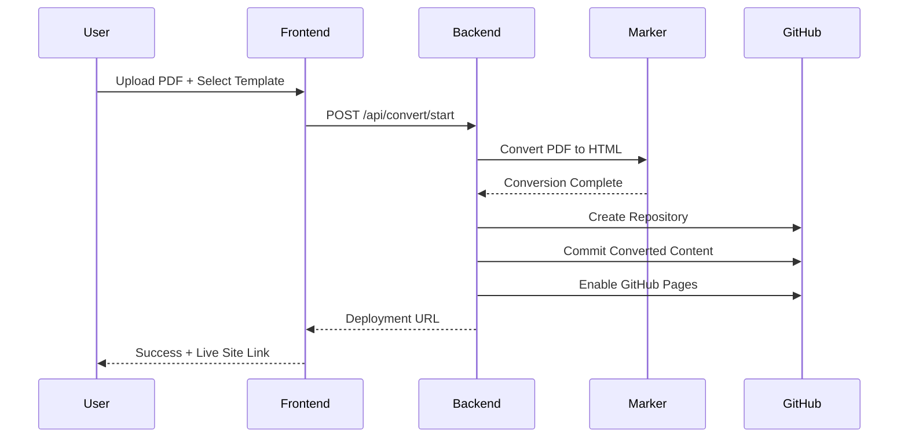

# DevLog-003: MVP End-to-End Integration

**Date**: 2025-08-31  
**Phase**: Phase 2 - MVP Integration & Complete Workflow  
**Goal**: Build working MVP that processes PDF → GitHub Pages deployment

## Overview

With the marker converter fully tested and optimized (38-second conversions), we're ready to integrate all components into a complete end-to-end workflow. This DevLog outlines the implementation plan for an MVP that takes a user from PDF upload to deployed GitHub Pages site.

## Current State Assessment

### ✅ **Production-Ready Components**
1. **Frontend**: React + TypeScript with GitHub OAuth flow
2. **Backend**: FastAPI with OAuth endpoints (port 8001)
3. **Marker Converter**: Optimized with smart mode, 9.5x performance improvement
4. **Authentication**: Complete GitHub OAuth integration
5. **Testing**: Comprehensive test suite with real PDF validation

### 🎯 **Missing Components for MVP**
1. **Backend Conversion API**: Marker converter not integrated into FastAPI
2. **File Upload Handling**: No API endpoints for PDF/DOCX upload
3. **Progress Tracking**: No real-time conversion status
4. **Repository Creation**: No GitHub repo creation workflow
5. **Template Integration**: Converted content not connected to GitHub Pages
6. **End-to-End Flow**: No complete user journey from upload to deployment

## MVP Architecture



## Implementation Plan

### **Phase 2A: Backend Integration (Week 1)**

#### **Task 1: Conversion Service Integration**
**Priority**: HIGH  
**Estimated Time**: 2-3 days

**Implementation Steps**:
1. **Move Converter to Backend**
   ```bash
   # Add marker-pdf to backend dependencies
   cd backend && uv add marker-pdf PyPDF2
   ```

2. **Create Conversion Service Module**
   ```python
   # backend/services/conversion_service.py
   from scripts.marker_converter import MarkerConverter, ConversionMode
   
   class ConversionService:
       def __init__(self):
           self.converter = MarkerConverter(mode=ConversionMode.AUTO)
       
       async def convert_pdf(self, file_path: Path, output_dir: Path) -> ConversionResult:
           # Async wrapper around marker converter
           # Return conversion metadata and file paths
   ```

3. **Add Conversion Endpoints**
   ```python
   # backend/main.py additions
   @app.post("/api/convert/upload")
   async def upload_and_convert(file: UploadFile, template: str):
       # Handle file upload, start conversion, return job ID
   
   @app.get("/api/convert/status/{job_id}")
   async def get_conversion_status(job_id: str):
       # Return conversion progress and status
   
   @app.get("/api/convert/result/{job_id}")
   async def get_conversion_result(job_id: str):
       # Return converted content and metadata
   ```

#### **Task 2: File Upload & Storage**
**Priority**: HIGH  
**Estimated Time**: 1-2 days

**Implementation**:
- Temporary file storage in `/tmp/conversions/{job_id}/`
- File validation (PDF/DOCX format, size limits)
- Cleanup mechanism for old files
- Unique job ID generation (UUID)

#### **Task 3: Background Task Processing**
**Priority**: MEDIUM  
**Estimated Time**: 1-2 days

**Implementation**:
- FastAPI BackgroundTasks for async conversion
- In-memory job status tracking (Redis for production)
- Progress callbacks from marker converter
- Error handling and timeout management

### **Phase 2B: GitHub Integration (Week 2)**

#### **Task 4: Repository Creation Service**
**Priority**: HIGH  
**Estimated Time**: 2-3 days

**Implementation Steps**:
1. **GitHub API Service**
   ```python
   # backend/services/github_service.py
   class GitHubService:
       def __init__(self, access_token: str):
           self.token = access_token
       
       async def create_repository(self, name: str, template: str) -> Repository:
           # Create repo from template
           # Enable GitHub Pages
           # Return repo details
   ```

2. **Template Repository Setup**
   - Create template repositories for each theme
   - Academic Pages, al-folio, minimal academic templates
   - Template selection and customization

3. **Content Integration**
   - Merge converted HTML/markdown with template
   - Image asset handling and optimization
   - Metadata extraction and integration

#### **Task 5: Deployment Workflow**
**Priority**: HIGH  
**Estimated Time**: 2-3 days

**Implementation**:
- Commit converted content to user repository
- Trigger GitHub Pages build
- Monitor deployment status
- Return live site URL to user

### **Phase 2C: Frontend Integration (Week 3)**

#### **Task 6: Upload & Progress UI**
**Priority**: HIGH  
**Estimated Time**: 2-3 days

**Implementation**:
- File upload component with drag-and-drop
- Conversion mode selector (auto/fast/quality)
- Real-time progress display with WebSocket
- Error handling and retry mechanisms

#### **Task 7: Repository Configuration UI**
**Priority**: MEDIUM  
**Estimated Time**: 1-2 days

**Implementation**:
- Repository name input and validation
- Template selection with previews
- Deployment settings configuration
- Success page with live site link

## Technical Specifications

### **Backend Dependencies to Add**
```toml
# backend/pyproject.toml additions
marker-pdf = "^1.9.0"      # PDF conversion
PyPDF2 = "^3.0.0"          # PDF quality assessment
python-multipart = "^0.0.6" # File upload handling
websockets = "^12.0"       # Real-time progress
aiofiles = "^23.2.1"       # Async file operations
```

### **API Endpoints Design**

#### **Conversion Endpoints**
```python
POST /api/convert/upload
- Body: multipart/form-data (file + template + mode)
- Response: {"job_id": "uuid", "status": "queued"}

GET /api/convert/status/{job_id}
- Response: {"status": "processing", "progress": 45, "stage": "extracting_images"}

WebSocket /api/convert/progress/{job_id}
- Real-time progress updates
- Error notifications
- Completion events
```

#### **GitHub Integration Endpoints**
```python
POST /api/github/repository/create
- Body: {"name": "paper-site", "template": "academic-pages", "conversion_id": "uuid"}
- Response: {"repo_url": "...", "pages_url": "..."}

GET /api/github/repository/{repo_id}/status
- Response: {"build_status": "success", "pages_url": "https://user.github.io/repo"}
```

### **File Structure Updates**
```
backend/
├── main.py                    # FastAPI app with new endpoints
├── services/
│   ├── conversion_service.py  # Marker converter integration
│   ├── github_service.py      # Repository creation & deployment
│   └── file_service.py        # Upload & storage handling
├── models/
│   ├── conversion.py          # Pydantic models for conversion
│   └── github.py              # GitHub API models
└── utils/
    ├── job_tracker.py         # Background job management
    └── cleanup.py             # Temporary file cleanup
```

## Success Criteria for MVP

### **Functional Requirements**
1. ✅ **User Authentication**: GitHub OAuth login working
2. 🎯 **File Upload**: PDF/DOCX upload with validation
3. 🎯 **Conversion**: Marker converter processes files (38-second target)
4. 🎯 **Progress Tracking**: Real-time conversion status updates
5. 🎯 **Repository Creation**: New GitHub repo with converted content
6. 🎯 **GitHub Pages**: Automatic deployment and live site URL
7. 🎯 **Template Integration**: At least one working template (academic-pages)

### **Performance Requirements**
- **Conversion Time**: <60 seconds for typical academic papers
- **Upload Limit**: 50MB file size maximum
- **Concurrent Users**: Support 3-5 simultaneous conversions
- **Error Rate**: <5% conversion failures

### **User Experience Requirements**
- **One-Click Flow**: Minimal user input required
- **Progress Feedback**: Clear status updates throughout process
- **Error Handling**: Helpful error messages and recovery options
- **Success Confirmation**: Clear indication of successful deployment

## Risk Assessment & Mitigation

### **High-Risk Areas**
1. **GitHub API Rate Limits**: Implement request throttling and caching
2. **Conversion Failures**: Robust error handling and fallback modes
3. **File Storage**: Implement cleanup and size limits
4. **Concurrent Processing**: Queue management and resource limits

### **Mitigation Strategies**
- **Comprehensive Testing**: End-to-end integration tests
- **Graceful Degradation**: Fallback to placeholder mode if needed
- **User Communication**: Clear error messages and next steps
- **Monitoring**: Logging and error tracking for debugging

## Timeline & Milestones

### **Week 1: Backend Foundation**
- Day 1-2: Conversion service integration
- Day 3-4: File upload and storage
- Day 5-7: Background task processing

### **Week 2: GitHub Integration**
- Day 1-3: Repository creation service
- Day 4-5: Template integration
- Day 6-7: Deployment workflow

### **Week 3: Frontend & Testing**
- Day 1-3: Upload and progress UI
- Day 4-5: Repository configuration UI
- Day 6-7: End-to-end testing and bug fixes

### **Success Metrics**
- **Week 1**: Backend can convert PDF and return HTML
- **Week 2**: Backend can create GitHub repo with converted content
- **Week 3**: Complete user flow from upload to live site

## Next Actions

### **Immediate Tasks (This Week)**
1. **Setup Backend Dependencies**: Add marker-pdf and file handling libraries
2. **Create Conversion Service**: Move marker converter to backend services
3. **Implement Upload Endpoint**: Basic file upload with job ID generation
4. **Test Integration**: Verify marker converter works in FastAPI context

### **Success Definition**
MVP is complete when a user can:
1. Upload a PDF through the web interface
2. See real-time conversion progress
3. Receive a live GitHub Pages URL
4. View their converted paper as a professional website

**Target Completion**: 3 weeks from start date  
**Next DevLog**: Will document the backend integration implementation and any challenges encountered.
