# Playground

Feels like I have played with various programming stuff over the years. Maybe it is worth documenting and sharing.

Projects that have spun off:

- Oct 2024: [Tab Tree Tracker](https://github.com/jwt625/TabTreeTracker): a Chrome extension that visualizes your browser tab navigation history as an interactive tree structure. Track, analyze, and visualize how your browsing sessions evolve over time.

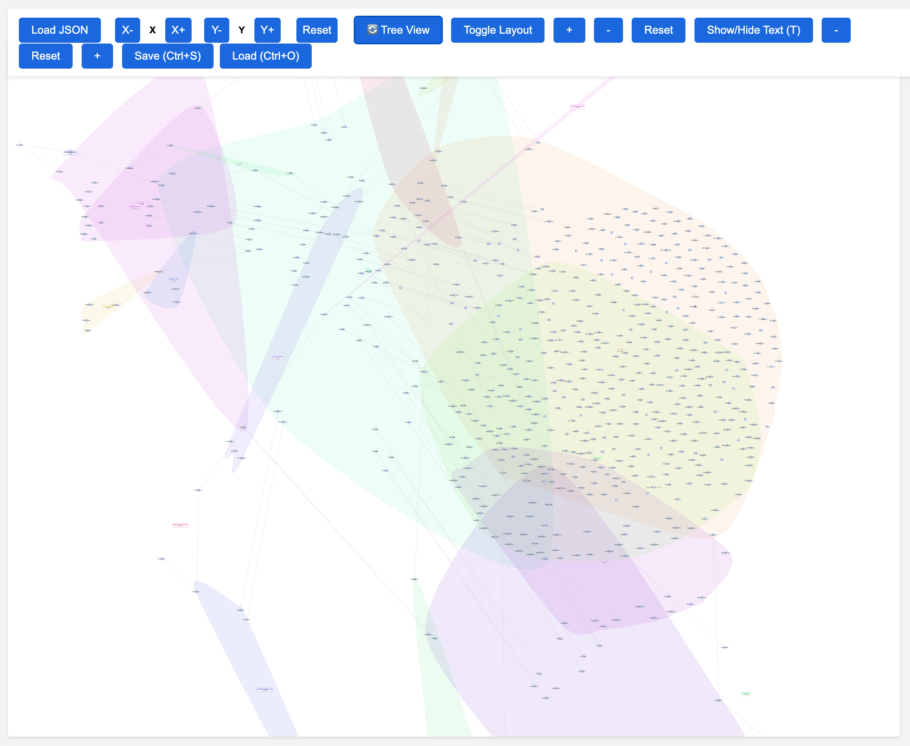

- Mar 2025: [BPM (Beam Propagation Method)](https://github.com/jwt625/BPM): a toy Python library for simulating beam propagation in integrated photonics using the Beam Propagation Method (BPM).
  - Try it: [huggingface.co/spaces/jwt625/BPM](https://huggingface.co/spaces/jwt625/BPM).

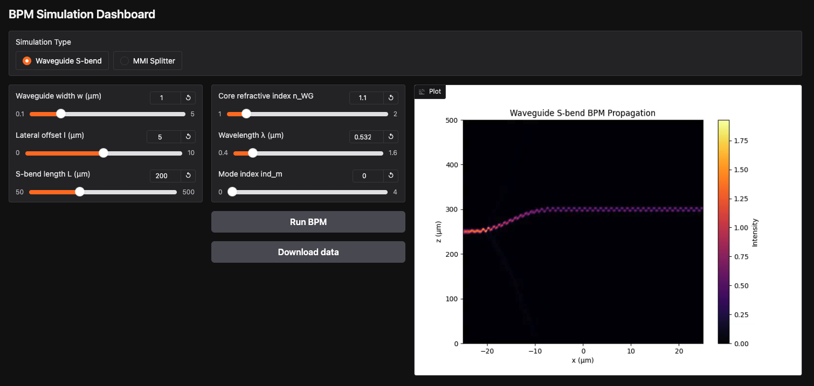

- Jun 2025: [VoiceModeTranscript](https://github.com/jwt625/VoiceModeTranscript): a real-time transcript recorder for ChatGPT voice conversations with dual audio capture, whisper.cpp streaming, and intelligent LLM deduplication.
  - actually works for any mic and system audio transcribing

- Aug 2025: [Bay Bridge Traffic Cam](https://github.com/jwt625/bay-bridge-traffic-cam): a comprehensive real-time traffic detection and monitoring system for Bay Bridge with **Prometheus + Grafana integration** and **public dashboard access**.
  - Dashboard: [bay-bridge-traffic.com](https://bay-bridge-traffic.com/).
  - Example: [YouTube](https://www.youtube.com/watch?v=hsUUnUyjwE8).

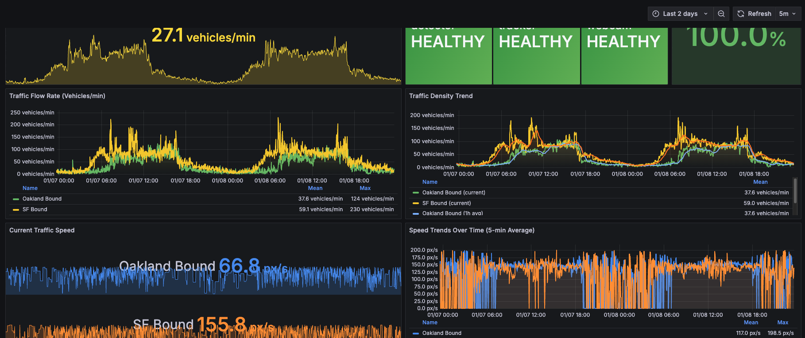

- Nov 2025: [3dgs-viewer](https://github.com/jwt625/3dgs-viewer): simple 3d gaussian splatting viewer based on [spark](https://github.com/sparkjsdev/spark).
  - Try it: [outside5sigma.com/3dgs-viewer](https://outside5sigma.com/3dgs-viewer).

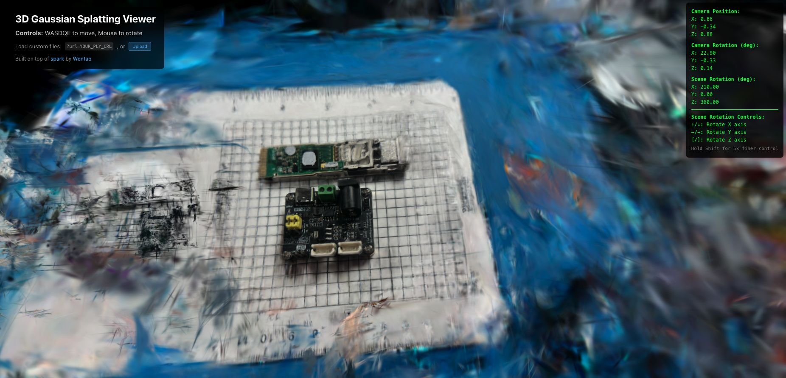

- Nov 2025: [GDSJam](https://github.com/jwt625/gdsjam/): Web-based live collaborative GDSII viewer for semiconductor layout visualization.
  - Website: [gdsjam.com](https://gdsjam.com/).

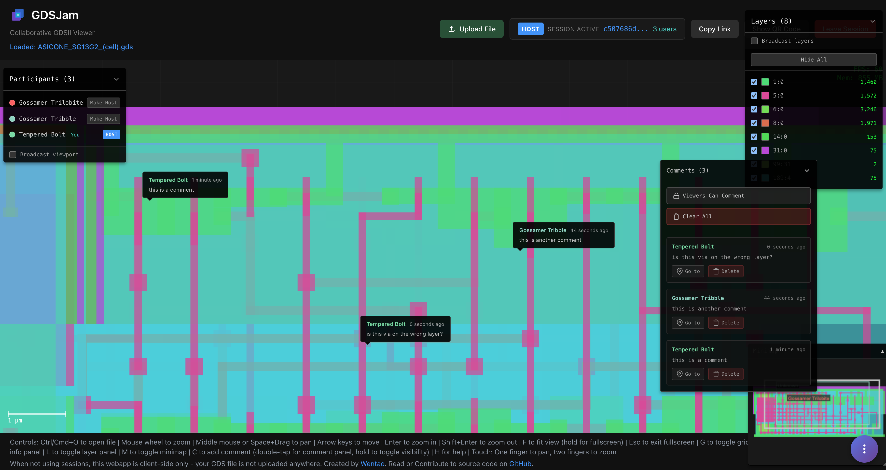

- Dec 2025: [psh (Programmable Snippet Helper)](https://github.com/jwt625/psh): a text expansion tool with directive-based syntax for dynamic snippet expansion. Reuse frequently-used prompts for LLMs without repetitive typing. Type `;;d.ne,l2` instead of "be concise, no emoji" every time.

- Jan 2026: [Claude Code Inspector](https://github.com/jwt625/claude-code-inspector): comprehensive tools for analyzing, tracking, and visualizing Claude Code agent workflows. Extract entities from API logs, track agent instances, build workflow DAGs, and visualize with interactive React-based viewer.

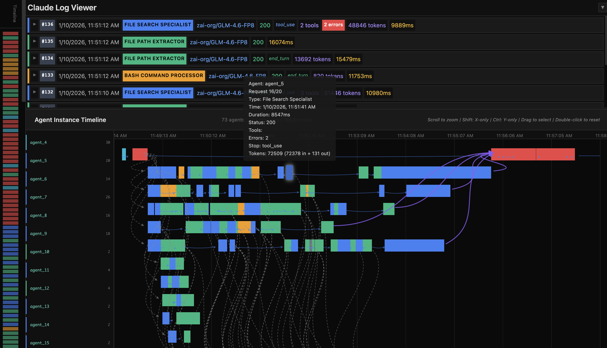

- Jan 2026: [SLM Guessr](https://github.com/jwt625/SLM-Guessr): an educational web application for training intuition on Spatial Light Modulator (SLM) phase masks and their corresponding 2D FFT intensity patterns. Features progressive curriculum with 150+ samples across 7 difficulty levels, gallery mode, and quiz mode.
  - Try it: [outside5sigma.com/SLM-Guessr](https://outside5sigma.com/SLM-Guessr).

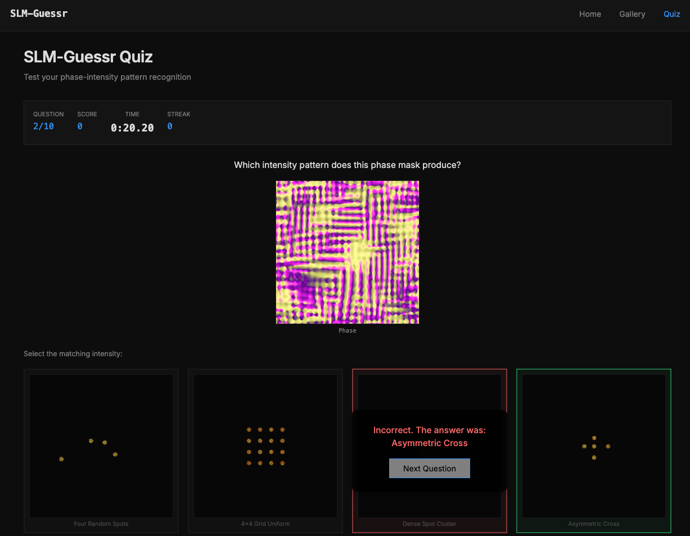

- Feb 2026: [WebSpice](https://github.com/jwt625/WebSpice): a browser-based SPICE circuit simulator with a minimal LTSpice-like GUI. Runs entirely client-side using NGSpice compiled to WebAssembly.
  - Try it: [outside5sigma.com/WebSpice](https://outside5sigma.com/WebSpice/).

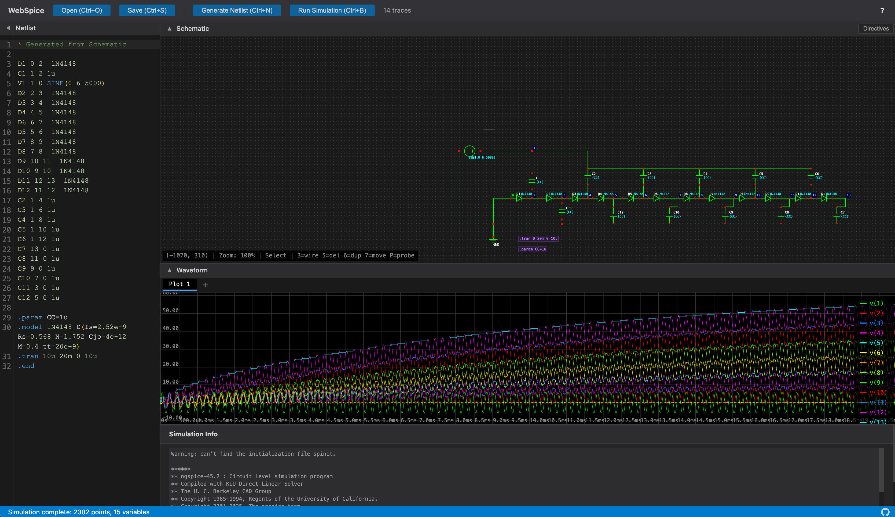

- Mar 2026: [Multipole Cow](https://github.com/jwt625/PlayGround/tree/main/20260327_multipole_cow): reproduction of the spherical-harmonic surface expansion from *Higher multipoles of the cow* (Section III.1). The libigl benchmark cow is flowed to a near star-shaped shell along the signed-distance gradient, fitted with spherical harmonics up to l = 24, and reconstructed as one OBJ mesh per order. Includes a Three.js viewer to orbit each order or compare all in a grid.

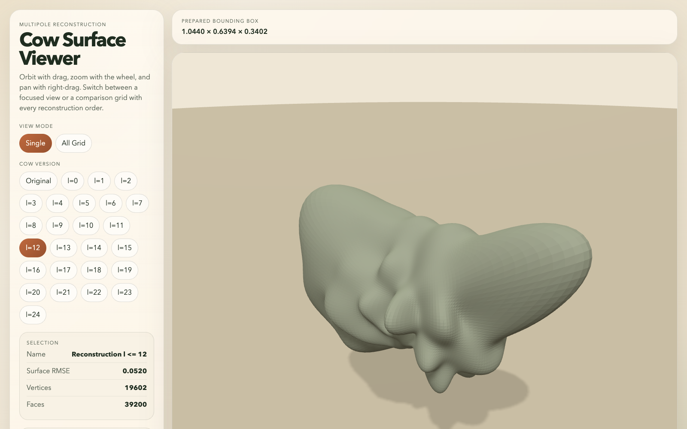

- Apr 2026: [USGS Minerals And Infrastructure Atlas](https://github.com/jwt625/USGS_Minerals_Infra_Atlas): a static interactive atlas for exploring USGS National Minerals Information Center regional GIS releases across Africa, China, Indo-Pacific, Latin America & Caribbean, and Southwest Asia.
  - Try it: [jwt625.github.io/USGS_Minerals_Infra_Atlas](https://jwt625.github.io/USGS_Minerals_Infra_Atlas/).

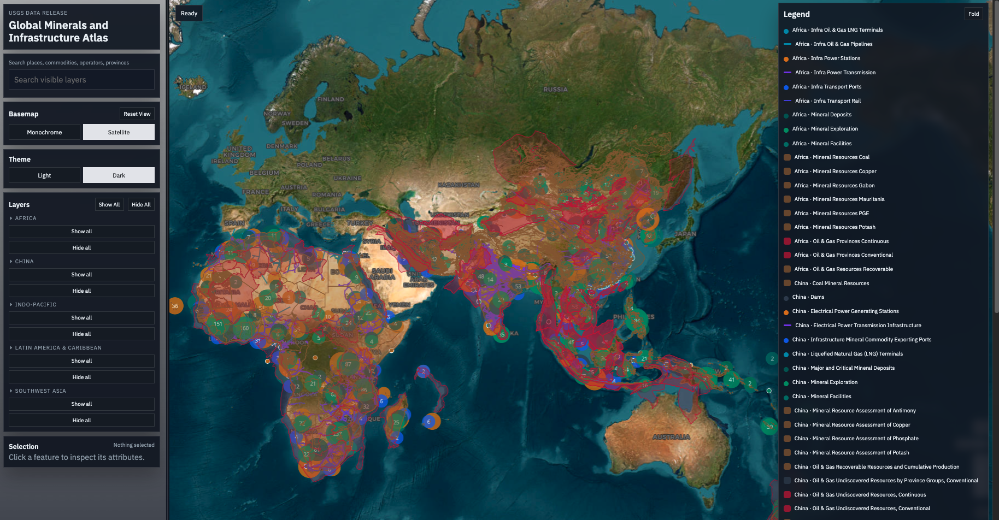

- May 2026: [IEEE 802.3 AI / High-Speed Ethernet Cache](https://github.com/jwt625/ieee802_3dj_browser): a static browser and local cache for IEEE 802.3 public materials relevant to AI scale-up, AI scale-out, high-speed Ethernet, P802.3dj, E4AI, 200G/lane MMF, P802.3ds, and 400G/lane signaling.
  - Try it: [outside5sigma.com/ieee802_3dj_browser](https://outside5sigma.com/ieee802_3dj_browser/).

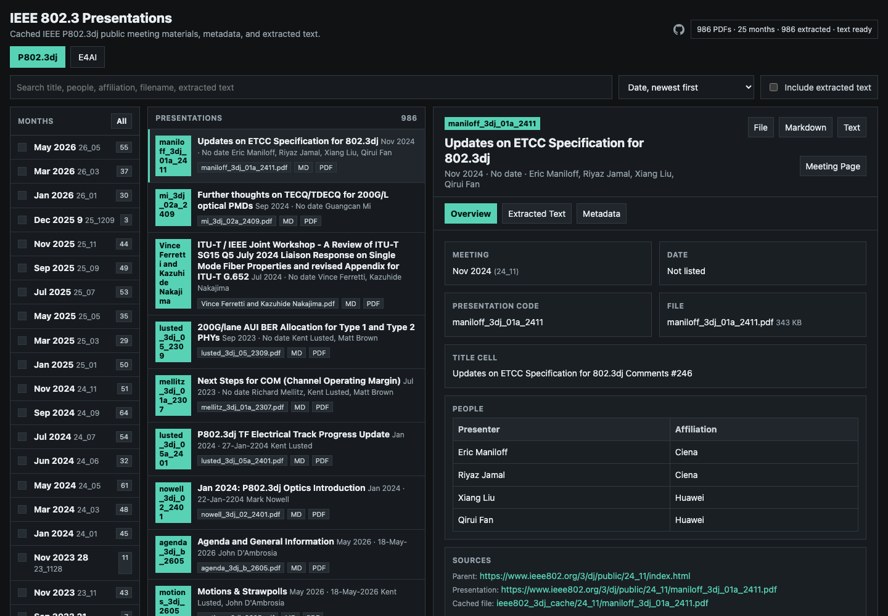

- May 2026: [Optical DSP Link Visualizations](https://github.com/jwt625/optical-dsp-link): browser-based educational visualizations for optical DSP and SerDes concepts, including payload/FEC/PAM4 mapping, Tx precompensation, SerDes/DAC, optical channel impairment, CDR timing, Rx equalization, and recovered payload flow.
  - Try it: [outside5sigma.com/optical-dsp-link](https://outside5sigma.com/optical-dsp-link/).

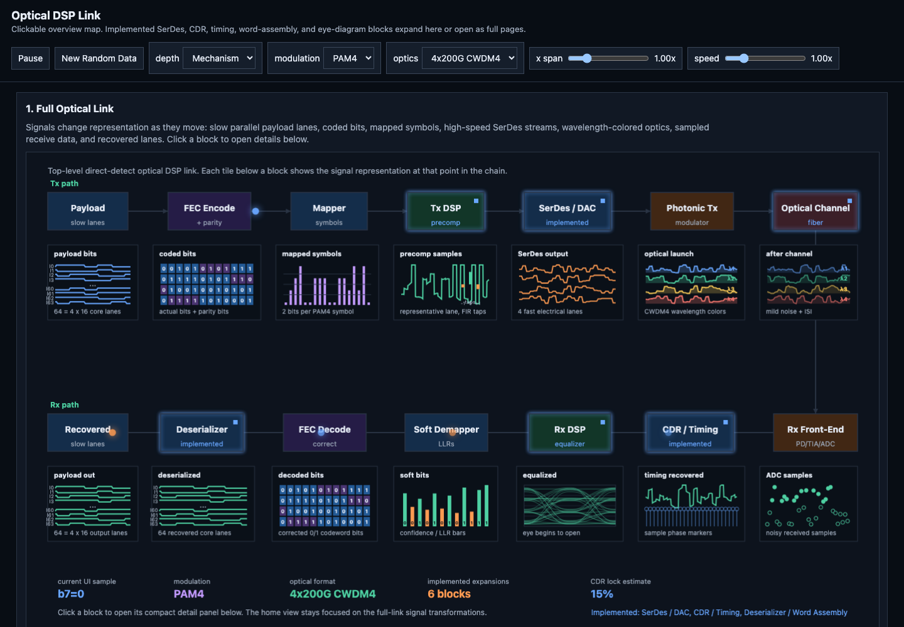

- Jun 2026: [2D EO Cross-Section Solver Prototype](https://github.com/jwt625/PlayGround/tree/main/20260614_2d_eo_fem_solver): browser-first electro-optic modulator cross-section solver with YAML-configured geometry, 2D electrostatic extraction, tensor-permittivity RF assembly, optical mode solving, field visualization, and Python reference tests.

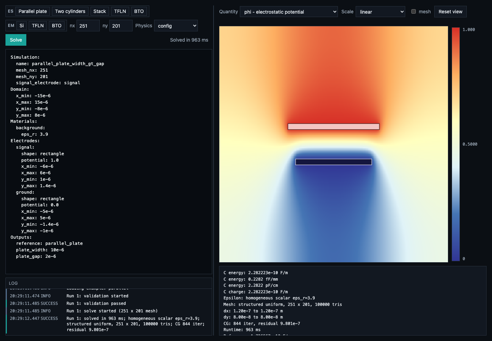

- Aug 2026: [Nonuniform Thermally Chirped FBG](https://github.com/jwt625/PlayGround/tree/main/20260802_nonuniform_FBG): coupled-mode / transfer-matrix reconstruction of the heated-spectrum figure (Fig. 5a) from an all-fiber microheater paper in Optics Express (2026), with a semi-analytic cylindrical-fin temperature model. The hot-spot temperature profile is recovered by inverting six digitized heated spectral envelopes; identifiability limits are documented in the model notes.

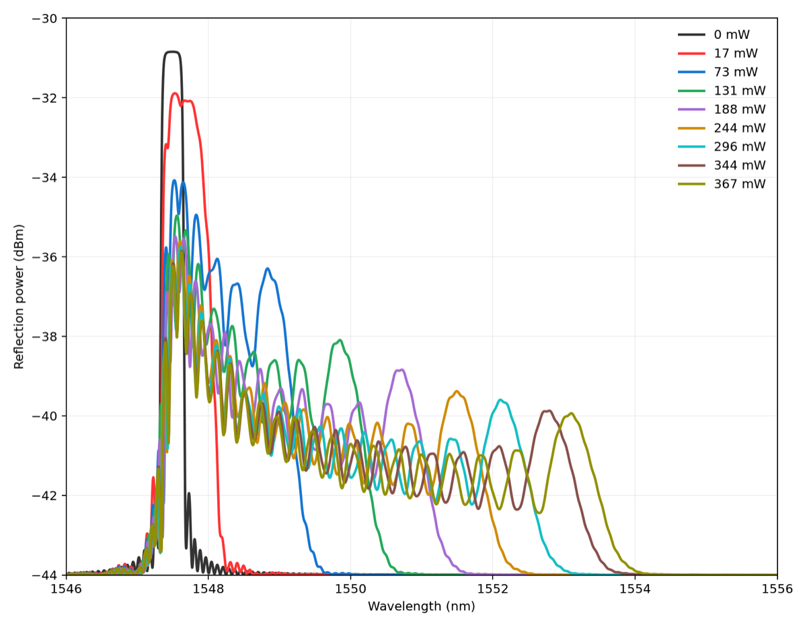

- Aug 2026: [Photonics Lineage](https://github.com/jwt625/PlayGround/tree/main/20260823_photonics_lineage): evidence-graded, regenerable person-level genealogy of the photonics industry (172 organizations, 288 people, 556 edges, 282 sources in the current canonical set), with a founder-lineage Sankey view. Each claim carries a source URL and an evidence grade; only A/B-grade evidence enters the default graph.

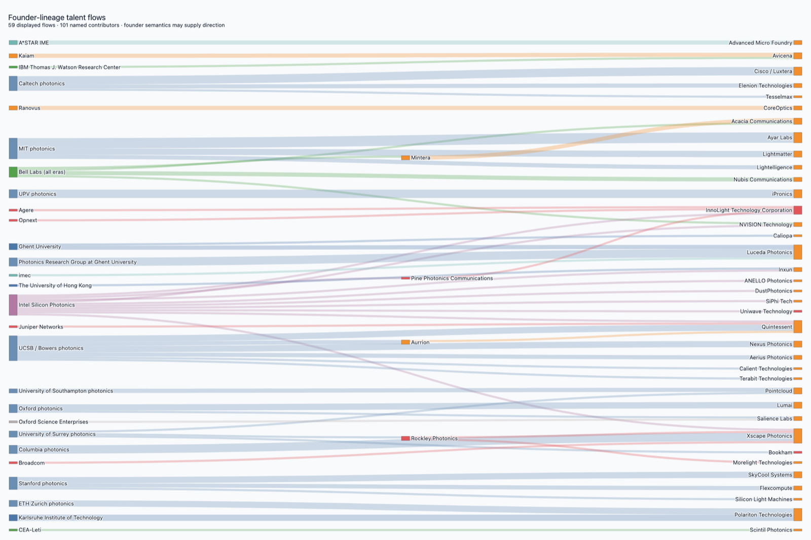

- Sep 2026: [PHIELDWORKS (Coherent Factorio)](https://github.com/jwt625/PlayGround/tree/main/20260911_coherent_factorio): desktop-browser factory game about turning an industrial network into a controlled wave system. Wire emitters and phase tuners, hold field on target, defend the outpost, and commission a reusable blueprint. Runs fully client-side (Vite + TypeScript).

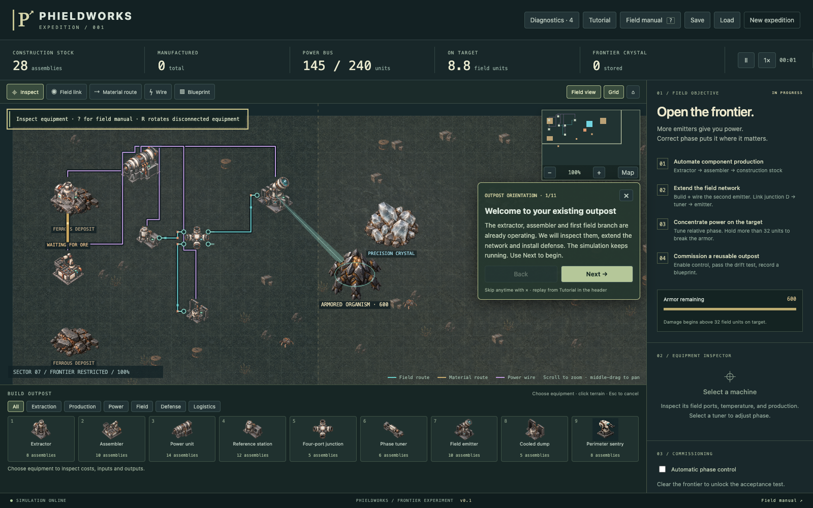

- Sep 2026: [Fruit-Fly CBC](https://github.com/jwt625/PlayGround/tree/main/20260915_fruit_fly_nn): a sparse recurrent reservoir built on the MaleCNS fruit-fly connectome that learns to phase-lock and steer a simulated coherent-beam-combining laser array, then tracks a second virtual fly as a moving target. Three.js bench with a far-field view; simulation and art only, no physical laser interface.

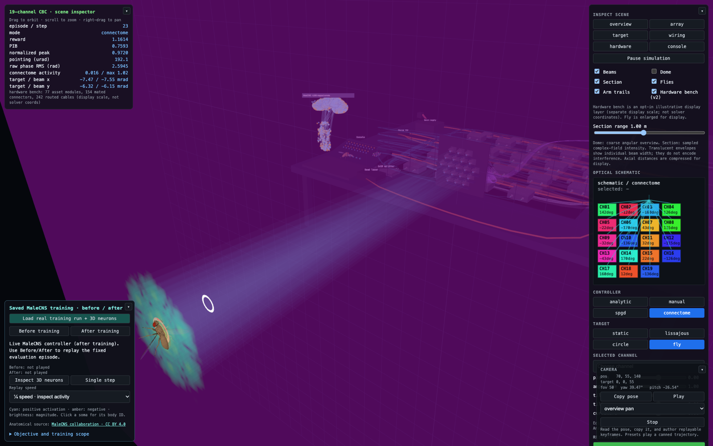

- Sep 2026: [Mode Overlap](https://github.com/jwt625/PlayGround/tree/main/20260913_mode_overlap): intuition trainer for photonic mode matching in the style of SLM Guessr. Estimate overlap and mismatch loss for Gaussian mode pairs, with a gallery, a 20-question speedrun and practice mode. Waveguide modes are solved in-browser (experimental scalar quasi-TE); the full-vector 2D backend is still pending.

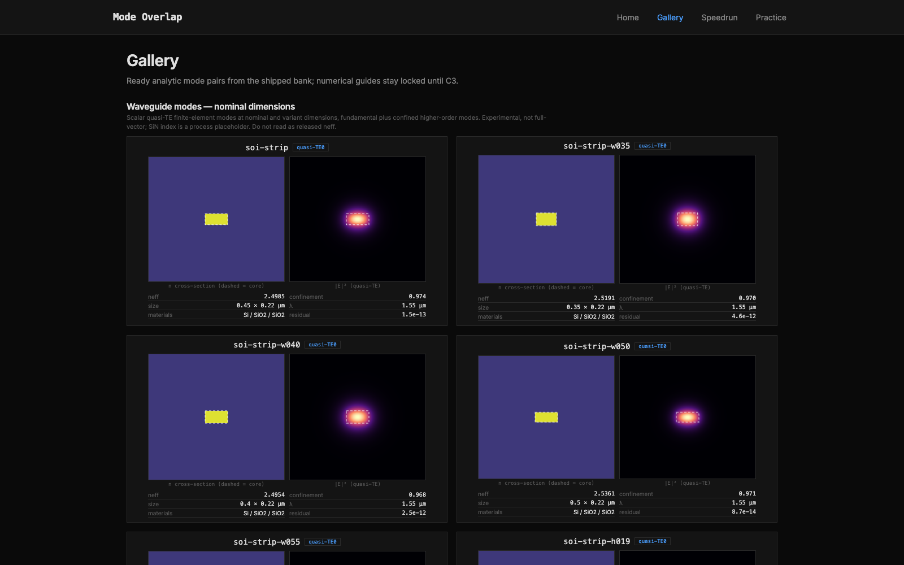

- Sep 2026: [Power versus Mass](https://github.com/jwt625/PlayGround/tree/main/20260926_power_mass_plot): log-log comparison of whole-body or system power against mass for 40 animals, compute systems, spacecraft and transportation, with idle and peak endpoints, battery / SOFC / propellant specific-power guides and off-scale arrows. Data, provenance and estimate flags live in one JSON file that drives the plot.

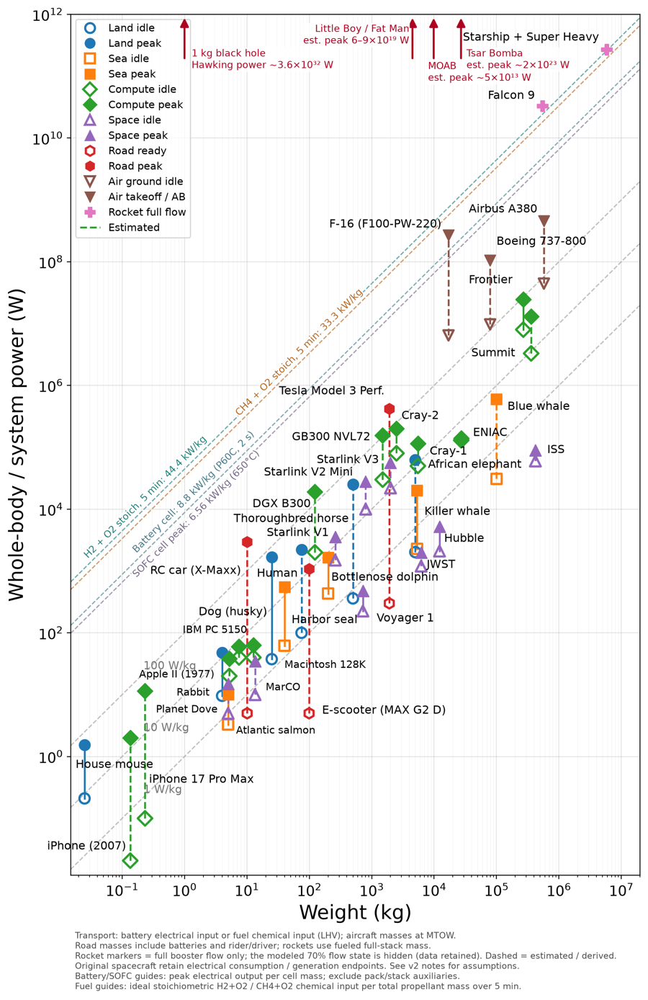
